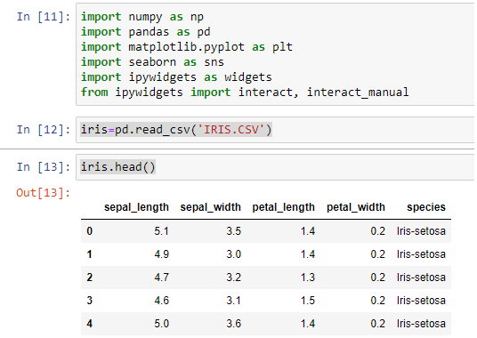

# QUANTUM with IBM

# Environnement de travail


Telecharger:

* [python](https://www.python.org/)
* [anaconda](https://www.anaconda.com/products/individual)

*Toutes les commandes executees seront dans Anaconda Prompt*


Installation de qiskit et jupyter (IDE online)

```cmd
pip install qiskit
conda install -c conda-forge jupyterlab
```


```cmd
cd My_projet
// Commande pour demarrer le server virtuel jupyter
My_projet:jupyter notebook

```
Une fois le serveur virtuel demarre, nous pouvons y ajouter python3 comme notebook.

ex: http://localhost:8888/tree


# Configuration du projet

Version python utilise

```cmd
(base) D:\PROGRAMMING\QUANTUM\QUANTUM\First_projet>python --version
Python 3.8.3
```


Execute le python installe sur la machine

```cmd
(base) D:\PROGRAMMING\QUANTUM\QUANTUM\First_projet>python
Python 3.8.3 (default, Jul  2 2020, 17:30:36) [MSC v.1916 64 bit (AMD64)] :: Anaconda, Inc. on win32
Type "help", "copyright", "credits" or "license" for more information.
>>>

```

Quitter python

```cmd
CTRL+Z
```

Exemple pour installer environnement python 2.7 sur un nouveau projet (application) se nommant firstApp_py27

```cmd
(base) D:\PROGRAMMING\QUANTUM\QUANTUM\First_projet>conda create -n py27 python=2.7

Collecting package metadata (current_repodata.json): done
Solving environment: failed with repodata from current_repodata.json, will retry with next repodata source.
Collecting package metadata (repodata.json): done
Solving environment: done
## Package Plan ##

  environment location: C:\Users\admin\anaconda3\envs\py27

  added / updated specs:
    - python=2.7
#
# To activate this environment, use
#
#     $ conda activate py27
#
# To deactivate an active environment, use
#
#     $ conda deactivate

```

Activer anaconda avec python27

```cmd
conda activate py27

(py27) D:\PROGRAMMING\QUANTUM\QUANTUM\First_projet>
```

Installer notebook ipykernel avec conda

```cmd
(py27) D:\PROGRAMMING\QUANTUM\QUANTUM\First_projet>conda install -c conda-forge jupyterlab
(py27) D:\PROGRAMMING\QUANTUM\QUANTUM\First_projet>conda install notebook ipykernel


```


Pour connaitre le contenu des package install

```cmd
(py27) D:\PROGRAMMING\QUANTUM\QUANTUM\First_projet>conda list --name base conda

# packages in environment at C:\Users\admin\anaconda3:
#
# Name                    Version                   Build  Channel
anaconda                  2020.07                  py38_0
anaconda-client           1.7.2                    py38_0
anaconda-navigator        1.9.12                   py38_0
anaconda-project          0.8.4                      py_0
conda                     4.9.1            py38haa95532_0
conda-build               3.18.11                  py38_1
conda-env                 2.6.0                         1
conda-package-handling    1.7.2            py38h76e460a_0
conda-verify              3.4.2                      py_1
msys2-conda-epoch         20160418                      1
```

Pour installer manuellement python3 kernel pour tous les utilisateurs de Jupyter notebook executer la commande suivanet:

```cmd
(base) D:\PROGRAMMING\QUANTUM\QUANTUM\First_projet>ipython kernel install --user
Installed kernelspec python3 in C:\Users\admin\AppData\Roaming\jupyter\kernels\python3

```

Maintenant qu'Anaconda est configure vous pouvez le desactiver et activer jupyter notebook

```cmd
jupyter notebook

```

# Mise a jour de l'environnement


```cmd
conda update --all
conda update anaconda
```

# Demo: exploration de l'interface notebook et execution de notre code 

1 . Apres avoir ouvert votre IDE Jupyter, cliquer sur new Python 2.

2 . Nommer ce fichier ex: ComprendreJupyter

3 . Cliquer sur le bouton "+" pour ajouter autant de ligne de code que vous voulez y inserer (ou ESC+A)

4 . Pour supprimer des lignes selectionner la et cliquer sur le ciseaux (ESC+DD)

5 . Exemple de code:
	
* Creation d'un input qui retourne lui-meme
	
```ipynb
raw_input("Enter your name: \n")
raw_input("Enter your name: \n")
Entrez votre nom: 
ruffin
'ruffin'
```

## Creation d'une comparaison de deux nombres retourne 1 si le premier chiffre est superieur au second retourne -1 dans le cas contraire.
	
```ipybn
cmp(1,0)
1
cmd(0,1)
-1
```
	
## Creation boucle for
	
```ipybn
for x in xrange(1,5) : print x
1
2
3
4
```

# Demo: ligne de commande "magic"

## Python version

```ipybn
!python -- version
# Python 3.8.5
```

## Print Working Directory (pwd on linux)

```ipybn
!cd
# C:\Users\admin
```

## Print Directory (ls on linux)

```ipybn
!dir
# ...
```

## Installation package avec pip ex: matplotlib

```ipybn
!pip install matplotlib


# Requirement already satisfied: matplotlib in c:\users\admin\anaconda3\lib\site-packages (3.3.2)
...
```

## Utilisation (import) package

```ipybn
import matplotlib as plt
plt.__version__

# '3.3.2'
```

## Installation package avec pip ex: numpy

```ipybn
!pip install numpy

# Requirement already satisfied: numpy in c:\users\admin\anaconda3\lib\site-packages (1.19.2)
```

## Utilisation de markdown

Selectionner dans le menu deroulant Code et selectionner MarkDown

## Liste des commandes "magics"

```ipybn
%lsmagic

# Available line magics:
%alias  %alias_magic  %autoawait  %autocall  %automagic  %autosave  %bookmark  %cd  %clear  %cls  %colors  %conda  %config  %connect_info  %copy  %ddir  %debug  %dhist  %dirs  %doctest_mode  %echo  %ed  %edit  %env  %gui  %hist  %history  %killbgscripts  %ldir  %less  %load  %load_ext  %loadpy  %logoff  %logon  %logstart  %logstate  %logstop  %ls  %lsmagic  %macro  %magic  %matplotlib  %mkdir  %more  %notebook  %page  %pastebin  %pdb  %pdef  %pdoc  %pfile  %pinfo  %pinfo2  %pip  %popd  %pprint  %precision  %prun  %psearch  %psource  %pushd  %pwd  %pycat  %pylab  %qtconsole  %quickref  %recall  %rehashx  %reload_ext  %ren  %rep  %rerun  %reset  %reset_selective  %rmdir  %run  %save  %sc  %set_env  %store  %sx  %system  %tb  %time  %timeit  %unalias  %unload_ext  %who  %who_ls  %whos  %xdel  %xmode

Available cell magics:
%%!  %%HTML  %%SVG  %%bash  %%capture  %%cmd  %%debug  %%file  %%html  %%javascript  %%js  %%latex  %%markdown  %%perl  %%prun  %%pypy  %%python  %%python2  %%python3  %%ruby  %%script  %%sh  %%svg  %%sx  %%system  %%time  %%timeit  %%writefile

Automagic is ON, % prefix IS NOT needed for line magics.
```

## Execution script python

Exemple myscript.py, fonction qui retourne le carre d'un nombre de 1 a 4.

```py
def square(x):
	return x ** 2
for i in range(1,4):
		print("Le carre de %s is"%i, square(i))

```

Puis dans Jupyter notebook tapper et executer la ligne suivante:

```ipybn
%run myscript.py
# Le carre de 1 is 1
# Le carre de 2 is 4
# Le carre de 3 is 9
```

Autre exemple: affichage d'une courbe sinusoidale.


Ou alors appeler le

```ipybn
%run JupyterNotebookTest/sin_curve.ipynb
# Graphique
```

# Magics command lines et cellules

## Sauvegarder une variable

Exemple

```ipybn
my_string='Je vais sauvegarder ma variable'
%store my_string
```

## Supprimer une variable

Exemple

```ipybn
my_string='Je vais sauvegarder ma variable'
del my_string
```

## Rappeler une variable dans un autre notebook meme si celle-ci a ete supprime

```ipybn
%store -r string
print(string)
# Mon string
```

## Affichage du contenu d'un programm py

```ipybn
%load JupyterNotebookTest/myscript.py

def square(x):
	return x ** 2
	
for i in range(1,4):
		print("Le carre de %s is"%i, square(i))
```

*Suivi de shift+enter l'execution du py se fais*


## Commande magique pour definir le format (ex: Markdown)

```ipybn
%%markdown
Ceci est un paragraphe markdown
```

## Commande magic **%%time**

```ipybn
%%time

import time
for i in range(1000):
        time.sleep(0.01)
# Wall time: 15.7 s
```

## Commande magic **%%timeit**

```ipybn
%%timeit
list_num=[n ** 2 for n in range(1000)]
# 180 µs ± 2.3 µs per loop (mean ± std. dev. of 7 runs, 10000 loops each)
```

## Creation d'un nouveau fichier en commande magic **%%writefile**

```ipybn
%%writefile JupyterNotebookTest/newfile.py
print('Hi')
# Writing JupyterNotebookTest/newfile.py
# Verification
%load JupyterNotebookTest/newfile.py
# %load JupyterNotebookTest/newfile.py
# print('Hi')
```

## Creation de **%%html**

```ipybn
%%html
<font size = 6 color = 'red'>
JUPYTER
</font>
```

# Travail en interaction avec les widgets

## Installation des widgets

```ipybn
!pip install ipywidgets
```

## Importation des bibliotheques

```ipybn
import numpy as np
import pandas as pd
import matplotlib.pyplot as plt
import seaborn as sns
import ipywidgets as widgets
from ipywidgets import interact, interact_manual
```

## Utiliser un fichier CSV

Apres avoir copier/coller votre fichier .CSV dans votre noteBook et importer les bibliotheque ci-dessus


```ipybn
iris=pd.read_csv('IRIS.CSV')
iris.head()
```


## Interaction avec le fichier .CSV

Exemplle: retourne toutes les fleurs qui ont plus de 5 petales.


```ipybn
@interact
def show_articles_more_than(column='sepal_length', x=5):
    return iris.loc[iris[column] > x]
```


# Conflits et visualisation donnees

## shape

Represente le nombre de ligne et de colonne de notre fichier CSV


```ipybn
iris.shape
# (150, 5)
```

## describe()

```ipybn
iris.describe()
```


## Controle si donnees vides ou nulls


```ipybn
iris.isnull().sum()
```


## Verification des doublons

Ici il n'ya a pas de doublon dans l'entete:

```ipybn
iris.duplicated().head()
```


Permet de savoir s'il existe des lignes en doublon:

```ipybn
iris.duplicated().sum()
```

Supprimer les lignes en doublons:


```ipybn
iris.drop_duplicates(keep=False, inplace=True)
```

## Visualisatiopn des donnees

```ipybn
plt.figure(figsize = (8,6))
plt.hist(iris['sepal_length'], bins =20, color ="g")
plt.xlabel("Sepal_length")
plt.ylabel("Count")
```


# Issu

[ERROR conda.core.link:_execute(698): ipykernel](https://www.heathmills.net/anaconda-upgrade-issues/)

[ipython kernel install --user LookupError: unknown encoding: cp65001](https://github.com/conda/conda/issues/5448)


```cmd
set PYTHONIOENCODING=UTF-8

```

ImportError: no module named win32api

```cmd
pip install pypiwin32
```